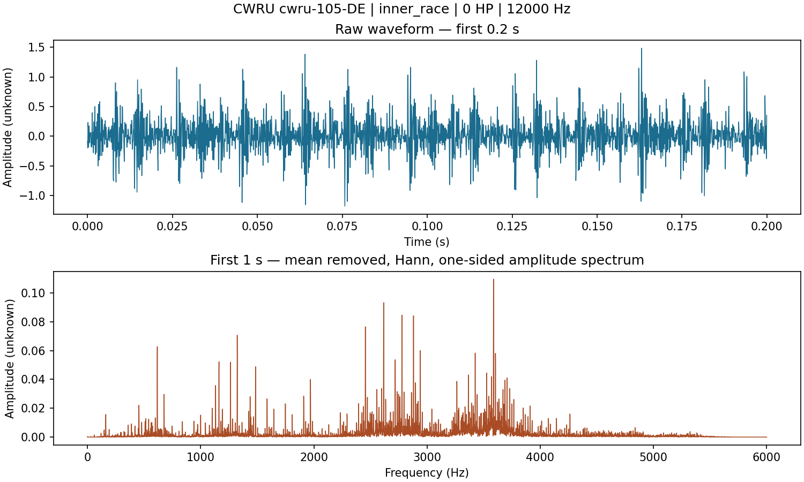

# M4 implementation and evidence

Implementation date: 14 September 2026. Base revision: `5197c8b4a919c9689931a1ca2da885f2ab7a7b7e`.

## Status

The manifest-driven pipeline and focused tests are implemented. **M4 remains in progress** until the selected four-class dataset is acquired, healthy-channel sampling metadata is resolved, and a complete preparation run is recorded. No model has been trained or scored by this work.

The real-record CI job downloads official recording 105 (IR007, 0 HP), validates the MAT channel, locks its hash, exports both preprocessing branches and plots a waveform/spectrum. Its success is evidence for one recording only. A green unit-test job is synthetic-fixture evidence, not a real-data result. CI saves downloadable evidence for 30 days; regenerate it using the commands below.

## Reproduce

Use Python 3.11 or newer. The M4 dependencies are separate from the TensorFlow/dashboard environment:

```bash
pip install -r requirements-m4.txt
python -m unittest discover -s tests -v
python -m src.data_pipeline acquire --manifest data/manifests/real_record_example.json --output data/example.lock.json
python -m src.data_pipeline prepare --manifest data/example.lock.json --output data/processed/real-example --record-example
python -m src.plot_record --manifest data/example.lock.json --record-id cwru-105-DE --output data/processed/real-example/record.png
```

Acquisition preserves existing raw files, checks previously pinned hashes and rejects missing channels. A first acquisition records observed hashes; these are not independently published checksums from CWRU. A lock file must not already exist and a preparation output directory must be empty. To rerun, choose new output paths; raw files are reusable. Do not replace a trusted hash when integrity verification fails.

`--record-example` permits incomplete class coverage and explicitly sets `classification_ready: false`. Full preparation requires all four classes in each partition. That flag describes minimum class coverage only, not statistical validity or model readiness. The normal workflow never silently drops invalid records.

## Selected cohort and unresolved metadata

[data/manifests/cwru_007_candidates.json](../data/manifests/cwru_007_candidates.json) contains 16 **candidate** DE-channel records: healthy and 0.007-inch inner-race, ball and outer-race faults over 0–3 HP. Outer-race position is controlled at 6:00 according to the official 12 kHz table. The files and class/load mapping come from:

- https://engineering.case.edu/bearingdatacenter/12k-drive-end-bearing-fault-data
- https://engineering.case.edu/bearingdatacenter/normal-baseline-data
- https://engineering.case.edu/bearingdatacenter/apparatus-and-procedures
- https://engineering.case.edu/bearingdatacenter/download-data-file

Official download links use `https://engineering.case.edu/sites/default/files/<number>.mat`. Candidate channel keys must match actual MAT arrays; they are never inferred from arbitrary numeric arrays. The fault-table sampling rate applies to the selected DE channels. The normal-baseline table does not specify each channel's sampling rate, and the general apparatus page mentions both 12 and 48 kHz. Therefore healthy rates and their sources are null and **full preparation fails closed** until independently verified. File length or a renamed `12k` filename is insufficient evidence.

RPM in the candidate manifest is explicitly the table's approximate RPM. Preparation also extracts the recording's `XnnnRPM` scalar when present, separately, without overwriting the source approximation. Units and calibration remain explicitly unknown; plots do not invent g units. SKF is documented for the selected small seeded defects; unknown fault depth remains null.

The frozen initial load split is 0/1 HP train, 2 HP validation, 3 HP test. This gives only two training recording groups and one validation/test recording per class. Later metrics would describe a very small cross-load benchmark, not industrial reliability or independent-bearing generalization. CWRU recordings may share the same physical bearing; recording isolation does not establish bearing isolation. No final-test scores should guide preprocessing or model selection.

After resolving healthy metadata with evidence, acquire the complete candidate cohort to a new lock and prepare without `--record-example`:

```bash
python -m src.data_pipeline acquire --manifest data/manifests/cwru_007_candidates.json --output data/cohort.lock.json
python -m src.data_pipeline prepare --manifest data/cohort.lock.json --output data/processed/cohort-v1
```

## Processing contract

- Required metadata, label semantics, explicit channel, finite real vectors, constants, signal length, hashes and group consistency are checked before output is written.
- Groups are assigned in the manifest before any resampling/windowing. Each group has one partition. Different channels share a group. Identical raw files cannot be assigned new groups. A canonical float64 channel hash also detects identical signals repacked into different MAT files. Transformed/trimmed derivatives cannot be discovered reliably from hashes: their original group must be retained explicitly.
- Whole-record resampling uses `scipy.signal.resample_poly`, a Kaiser beta-5 FIR and constant zero boundary padding. The rational rate ratio is reduced by its GCD. The finite-record edge treatment is recorded and may create edge transients; no extra bandpass is applied. The anti-alias test checks suppression of a 10 kHz tone when converting 48 to 12 kHz.
- Default target rate is 12 kHz, window size 2048 (0.1706667 s), hop 1024. Incomplete tails are dropped and counted. Samples are never padded into extra windows or mixed across records.
- Engineered-feature windows have their mean removed but retain amplitude. CNN windows divide that result by `max(population_std, 1e-8)`. Windows with standard deviation <= 1e-12 are rejected. Neither branch fits a dataset-level transform.
- NPZ arrays contain `feature_windows`, `cnn_windows`, numeric `labels`, string `record_ids` and `group_ids`, and target-rate `start_samples` (end exclusive = start + window_size). Load with `allow_pickle=False`.
- `summary.json` records manifest identity, partitions, file and signal hashes, source/target sample counts, measured RPM where available, tail counts, processing settings and dependency versions. `manifest.json` preserves the input lock.

The legacy `load_dataset()` API now fails explicitly because its output discards recording partitions. Existing training entry points therefore stop instead of producing window-leaked results. Integrating the new partition files with validated features and model bundles belongs to M5–M7. The dashboard remains a separate unvalidated prototype.

## Acceptance gate

- [x] Explicit manifest schema, labels, group partition checks and integrity validation.
- [x] Separate amplitude-preserving and normalized branches; anti-alias resampling.
- [x] Window provenance, duration, tail counts and reproducible exports.
- [x] Focused automated tests and real-record reproduction command/CI job.
- [x] Confirm real-record CI evidence and retain its summary/hash in the repository.
- [ ] Resolve healthy per-channel rates with provenance and acquire all selected records.
- [ ] Record successful full-cohort ingestion and class/group coverage.

Portfolio wording supported by implementation: "Implemented a manifest-driven CWRU ingestion pipeline with recording-level partitions, integrity checks, amplitude-preserving preprocessing and automated validation." Do not add classification accuracy, robustness or a completed M4 claim until the corresponding evidence exists.

## Confirmed first real-record evidence

[CI run 34847330407](https://github.com/M4Rk9/bearing-fault-diagnosis/actions/runs/34847330407) passed both jobs on head `43b69c9c34f7fbf9abe9c76af97f2f2c8583f05a` (PR test merge `a9af6c19d953b6ed17be7f5639c9c423a9c78ba5`). Downloaded artifact ZIP SHA-256: `e5db6f27c1b08588d021f146c008a0ab6174f7183a38fb5140c4e0f7e9efe070`.

The original CI [summary](../reports/m4/first-real-record/summary.json), [manifest](../reports/m4/first-real-record/manifest.json), and [plot settings](../reports/m4/first-real-record/record.json) are retained unchanged. Recording 105 contains 121,265 DE samples at the source-table rate of 12,000 Hz, yielding 117 complete 2048-sample windows with 50% overlap and 433 unused trailing samples. The MAT RPM value is 1797. Raw-file SHA-256: `f80b0ea04fd06b372a0eaec7c056543ea37e4bb4727a5b173d2a5bacd2aa9cab`.



This is an ingestion and visualization result, not fault-classification performance. The small waveform preview is not used to make a model claim. Newer summaries also include the pipeline source hash and per-class partition counts; the retained original summary predates those additive fields.
